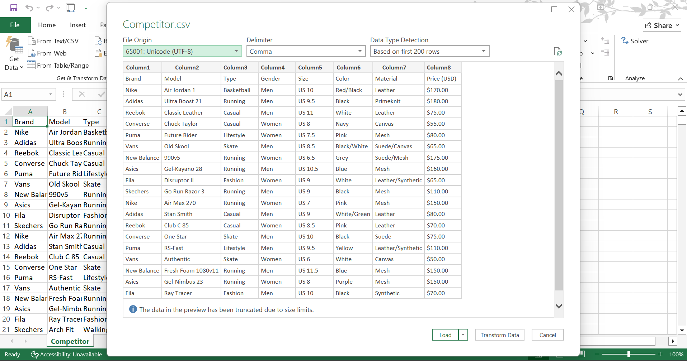
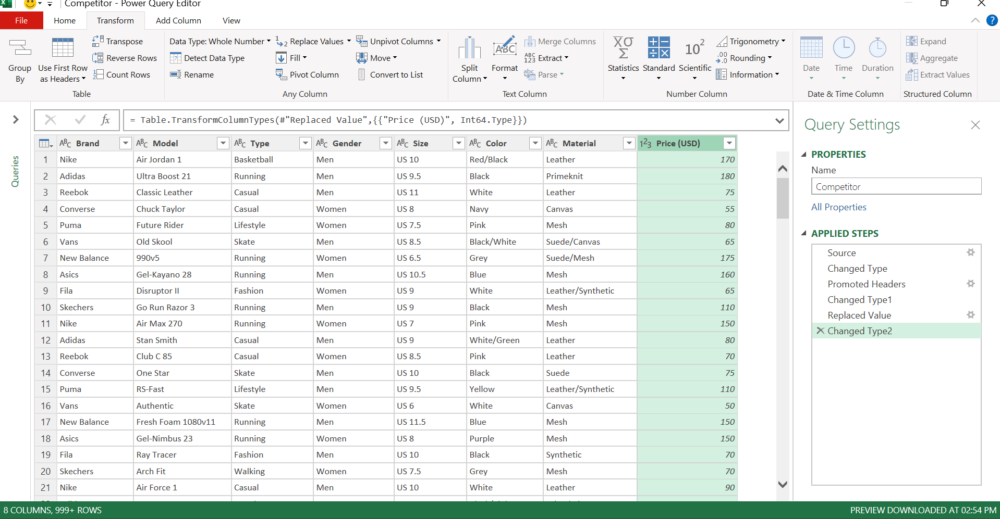
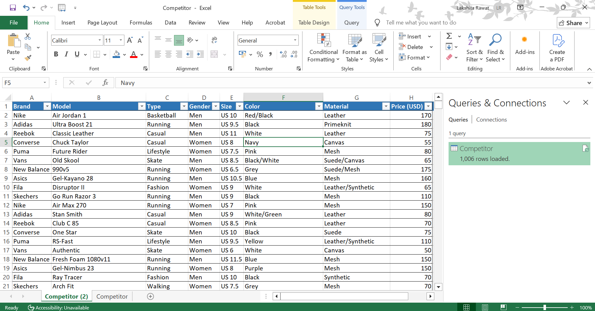

# **Sportswear Meets Data: Analyzing Puma’s Market Performance**
  

**Puma is a German multinational sportswear** manufacturer that designs, develops, and sells footwear, apparel, and accessories. Founded in **1948 by Rudolf Dassler**, the company originated from the Dassler Brothers Shoe Factory and is renowned for creating performance products that push sports and culture forward. Headquartered in **Herzogenaurach**, **Germany**, Puma operates globally and owns brands like **Cobra Golf**. 

## Table of Contents 
  1. Project Overview 
  2. Data Description and Processing
  3. Exploratory Data Analysis (EDA)
  4. Competitive Analysis       
  5. Visualization & Dashboards
  6. Business Recommendations 
  7. Conclusion

## 1. Project Overview
- ### **Objectives**
- To analyze Puma’s sales performance across products, regions, and channels
- To identify sales trends, seasonal patterns, and demand fluctuations
- To compare Puma’s performance with key competitors
- To provide key insights and strategic recommendations for growth

## 2. Data Description and Processing
- ### Data Sources
The dataset used in this project has been extracted from **Kaggle**, an open-source data platform. The dataset contains Puma’s sales records, including product details, categories, pricing, units sold, revenue, and regional information. [Puma Sales Dataset](https://www.kaggle.com/datasets/diabto/puma-dataset), [Competitor Sales Dataset ](https://www.kaggle.com/datasets/abdullahlahaji/footware-sales-dataset).

- ### Data Wrangling
This was performed using **Power Query** to clean and prepare the datasets. This involved removing duplicates, handling missing values, changing data types, and reporting data into a structured format. The cleaned datasets were then ready for further analysis.

### Puma Sales Dataset (Dataset_1)
[Unprocessed File](https://github.com/lakshita-03/PUMA/blob/main/data/Puma-Dashboard-START.csv)

[Processed File](https://github.com/lakshita-03/PUMA/blob/main/data/Dataset_1.csv)

### **Uncleaned Data**

  

### **Cleaned Data**

 

  

### Competitor Sales Dataset (Dataset_2)
[Unprocessed File](https://github.com/lakshita-03/PUMA/blob/main/data/Comp_old.csv)

[Processed File](https://github.com/lakshita-03/PUMA/blob/main/data/Competitor.csv)

### **Uncleaned Data**

  

### **Cleaned Data**

 

 

## 3. Exploratory Data Analysis of Puma US Sales(2020-2021)
In this section, we dive into the sales data to identify patterns, trends, and relationships across regions, products, and retailers. Through exploratory data analysis, we uncover meaningful insights that highlight performance drivers, inefficiencies, and growth opportunities.

#### **Dataset Overview**
The dataset contains detailed sales records of PUMA US Sales, capturing transactions across different products, retailers, regions, and time periods. The key columns include:

- Retailer – Name of the retail partner selling PUMA products
- Invoice Date – Date of the transaction
- Region – Geographical region of sales (West, Northeast, Midwest, South)
- State – US state where the sales occurred
- City – City where the transaction took place
- Product – Product categories include Men's Street Footwear, Men's Athletic Footwear, Women's Street Footwear, Women's Athletic Footwear, Men's Apparel, and Women's Apparel
- Price per Unit ($) – Selling price of one unit of the product
- Units Sold – Total quantity of products sold in the transaction
- Total Sales ($) – Revenue generated, calculated as Price per Unit × Units Sold
- Operating Profit ($) – Profit remaining after deducting all operating expenses (such as marketing, logistics, and administration) from Total Sales
- Operating Margin (%) – Ratio of Operating Profit to Total Sales, showing profitability percentage
- Sales Method – Channel of sale (Online, In-Store, or Offline)

### **Jupyter File**
<iframe src="notebooks/P_2_EDA.html" width="100%" height="800px"></iframe>

<iframe src="notebooks/P_2_EDA (2).html" width="100%" height="800px"></iframe>

 

## Findings & Insights from EDA
**1. Retailer Performance**
- Foot Locker and Sports Direct stand out as Star Performers, excelling in both high sales and healthy margins
- Walmart and Amazon, despite high sales volumes, show thin margins, making them risky volume players
  
**2. Regional Analysis**
- The West leads in sales and profit, but struggles with the lowest margin
- The South region is clearly the hidden gem, with fewer sales but the highest operating margin, and focusing on more profitable sales
  
**3. Product Analysis**
- Men’s Street Footwear and Women’s Apparel are star products, contributing strongly to both sales and profitability
- Women’s Athletic Footwear is a hidden gem (low sales, high margin), a potential growth area
- Men’s Apparel shows mixed performance, stable but not always profit-heavy
  
**4. Profitability Drivers**
- High revenue is not equal to high profitability. Walmart & Amazon rely on high volume but low margins, while Foot Locker & Sports Direct balance both, hence sustainable

**5. Sales Methods**
- Retail Stores are the most profitable channel
- Online & Outlets are growing but less profitable
  
**6. Correlation Analysis**
- Strong correlation between Units Sold, Sales, and Profit (>0.9)
- Operating Margin is weakly correlated with sales, proving that selling more does not guarantee profitability
  
**Conclusion**
- **Star Performers**:
   - Retailers: Foot Locker, Sports Direct, West Gear
   - Products: Men’s Street Footwear, Women’s Apparel
   - Regions/States: South (Hidden Gem)
- **Underperformers**:
   - Retailers: Walmart, Amazon (risky, low-margin players)
   - Products: Some apparel categories (e.g., Men’s Apparel) with low profit impact
   - Regions/States: West (Risky performance)
#### **Takeaway: Sustainable success lies in balancing high sales plus strong margins, not just chasing volume.** 

## 4. Competitive Analysis 
This section provides a comparative evaluation of Puma against its key competitors (Nike, Adidas, Reebok, New Balance, Asics, etc.) across multiple dimensions such as product innovation, price segmentation, revenue generation, etc. The goal is to identify Puma’s relative strengths, weaknesses, opportunities, and market gaps to guide strategic positioning.

### Dataset Overview
- Brand – The company name (e.g., Puma, Adidas, Nike, Reebok)
- Type – The product type as given in the dataset (e.g., Casual, Sneakers, Running, etc)
- Model – Specific product model identifier (examples from the dataset include Air Jordan 1, Ultra Boost 21, Classic Leather, Chuck Taylor, Future Rider, Old Skool, Air Force 1, NMD_R1, and many others)
- Price – Retail price of the product
- Color – Color variants offered for the model
- Gender – Target demographic (Men, Women)

### Jupyter File
<iframe src="notebooks/comp_analysis.html" width="100%" height="800px"></iframe>

## Final summary of Puma's Competitor Analysis

**Executive take:**
Puma is a **mid-market, lifestyle-first brand** with a clear **male bias** in assortment and revenue. Nike and Adidas lead overall through broader assortments, performance, material innovation, and stronger pricing power.

**Key findings:**
- Puma’s assortment and go-to-market focus are skewed toward men, which drives the majority of its sales.
- Puma occupies a value-for-money position: less expensive than premium rivals but above budget brands.
- Puma under-indexes in performance categories (mesh/knit-led lines) where competitors capture higher-margin demand.
- Puma relies more on traditional materials (leather/suede), exposing it to sustainability scrutiny compared with knit/canvas-led rivals.
- Puma’s mid-market pricing creates a clear consumer proposition between premium and budget brands, attractive to buyers who want brand value without a premium price.
However, price-gap charts show Puma leaves money on the table in premium categories and misses customers who want either cheaper basics or high-end performance.

**Implications:**
- The core opportunity is to grow women’s presence and performance offerings rather than change the brand’s entire identity.
- Material & sustainability moves will protect brand equity and appeal to eco-aware consumers without abandoning the mid-market position.

## 5. Visualization & Dashboards

<iframe title="PUMA_1" width="1000" height="374" src="https://app.powerbi.com/view?r=eyJrIjoiM2UwNDdjZTMtODA3Ny00OGFkLWIwYWYtZDJiYjQyNzBhNTY5IiwidCI6IjY1MTBmNjlkLWMzZjUtNDIxZi04ZGZlLWUxZDJiYzk3ZjI3NSJ9" frameborder="0" allowFullScreen="true"></iframe>
 

## 6. Business Recommendations
### **Executive Priorities (Next 3–6 Months)**

- **1. Boost Puma’s innovation & sustainable product pipeline**
    - **Problem:** Puma currently has fewer “future-trend” models (eco-friendly, knit, recycled-material, advanced-foam) compared to Adidas, Asics, and New Balance.
    - **Action:** Launch a focused Sustainable Capsule Collection of 4–8 products made from recycled materials, supported by a strong marketing campaign. Test the launch on the internet before fully starting it, and through a flagship retail partner.
  
- **2. Strengthen Puma’s women’s product portfolio**
    - **Problem**: Puma has a smaller product range for women and fewer options in certain price points compared to competitors.
    - **Action:** Introduce 10–15 new women-focused products in high-demand categories such as Lifestyle and Running, and by using micro-influencer campaigns, product-market fit can be validated

- **3. Price-tier optimization (move from mid-range to premium)**
    - **Problem:** Puma’s pricing is concentrated in the mid-range segment, while Nike and Adidas dominate the premium space (>$120).
    - **Action:** Introducing 1–2 premium flagship models with higher margins, testing price sensitivity through online pre-orders, positioning these products with strong storytelling (technology, athlete collaborations).

### **Tactical Priorities (6–12 Months)**

- **4. Broaden product depth in underrepresented categories**
    - **Problem:** Puma has fewer models in some categories (e.g., Running, Casual, Fashion, etc) where competitors are strong.
    - **Action:** Expanding product range in these categories by 20–30% to strengthen competitive presence.
  
- **5. Expand color & material diversity**
    - **Problem:** Competitors offer a greater variety of colors and materials, especially in lifestyle-oriented products.
    - **Action:** Adding 3–5 new color/material variations for the top 10 Puma models and testing limited-edition drops through digital channels.

### Analytical & Continuous Priorities

- **6. Advanced monitoring & dashboards**
    - **Action:** Building dashboards to track top-selling models, product sell-through, competitor price comparisons, trend-led launches, and price-segment share.

- **7. “Test & Learn” approach**
    - **Action:** Experimenting with limited-edition drops and targeted price promotions. Measuring whether sales are incremental or cannibalizing existing products.

## 7. Conclusion
This project provided a comprehensive analysis of Puma’s U.S. sales performance and its competitive positioning against major brands. Through exploratory data analysis and competitor benchmarking, we identified Puma’s strengths in affordability and performance loyalty, while also highlighting gaps in premium pricing, product portfolio diversity, and model-level competitiveness. The insights from this study not only underscore Puma’s current market standing but also reveal opportunities to refine pricing strategies, expand product offerings, and capture a broader range of consumer segments.

[Github Link](https://github.com/lakshita-03/PUMA)
